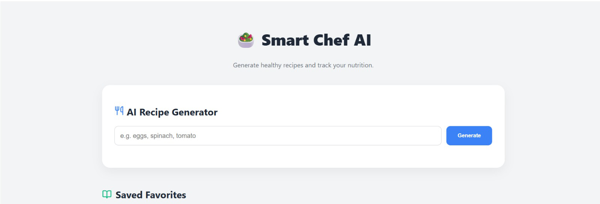

# 🥗 Smart Chef AI - Recipe & Nutrition Tracker

An AI-driven MERN stack application that generates healthy recipes and tracks nutritional data using Google Gemini 1.5 Flash.

**Live Demo:** [https://ai-recipe-app-peach.vercel.app](https://ai-recipe-app-peach.vercel.app)

## ✨ Features
- **AI Generation:** Get instant recipes based on ingredients.
- **Auto-History:** Search history is logged to MongoDB Atlas.
- **Data Visualization:** Macros visualized via Chart.js.
- **Favorites System:** Save recipes with custom animations.

## 📸 App Showcase

## 🛠️ Tech Stack
- **Frontend:** React.js (Vercel)
- **Backend:** Node.js / Express (Render)
- **Database:** MongoDB Atlas
- **AI:** Google Gemini API