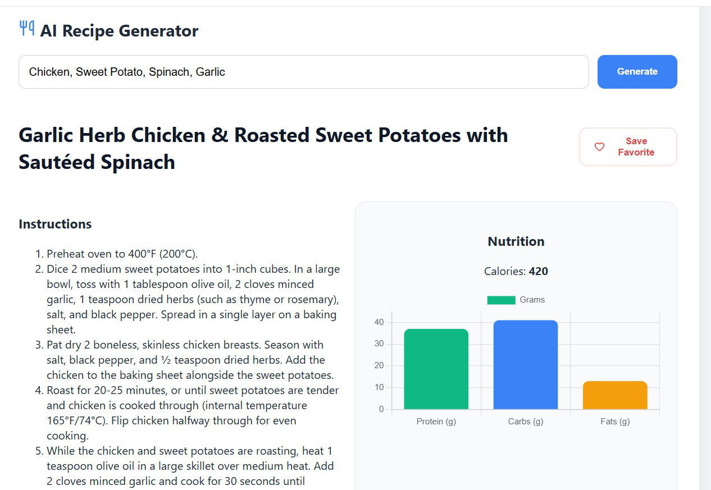

# 🥗 Smart Chef AI - Recipe & Nutrition Tracker

An AI-driven MERN stack application that generates recipes and tracks nutritional data.

## ✨ Features
- **AI Generation:** Uses Gemini 1.5 Flash.
- **Auto-Log:** Ingredients are automatically saved to MongoDB upon generation.
- **Data Viz:** Charts nutritional macros using Chart.js.
- **UX:** Premium blur-loading effects and heartbeat animations.

## 🚀 How to Run
1. **Clone the repo.**
2. **Server Setup:** - Go to `/server`, run `npm install`.
   - Create `.env` with `MONGO_URI` and `GEMINI_API_KEY`.
   - Run `npm run dev`.
3. **Frontend Setup:**
   - Go to `/client`, run `npm install`.
   - Run `npm start`.

## 📊 Demo Screenshot
