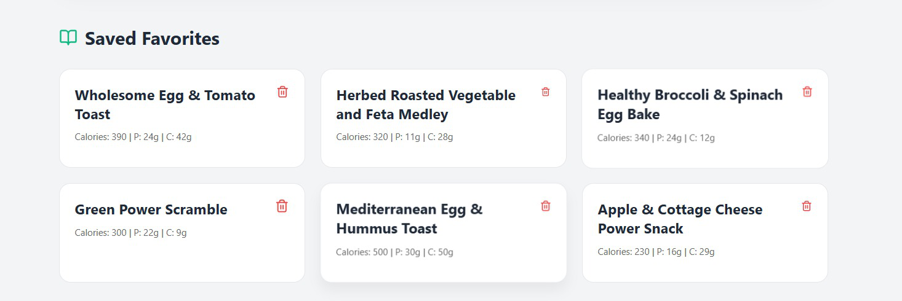

# 🥗 Smart Chef AI - Recipe & Nutrition Tracker

An AI-driven MERN stack application that generates healthy recipes and tracks nutritional data using Google Gemini 1.5 Flash.

## ✨ Features
- **AI Generation:** Get instant recipes based on ingredients you have.
- **Auto-History:** Every search is automatically logged to the MongoDB `ingredients` collection.
- **Data Visualization:** Interactive bar charts showing Protein, Carbs, and Fats.
- **Favorites System:** Save your favorite recipes with custom "heartbeat" animations and success toasts.
- **Premium UX:** Frost-blur loading state with a sharp custom "Chef Cooking" animation.

## 🚀 How to Run
1. **Clone the repo.**
2. **Server Setup:** - Go to `/server`, run `npm install`.
   - Create `.env` with `MONGO_URI` and `GEMINI_API_KEY`.
   - Run `npm run dev`.
3. **Frontend Setup:**
   - Go to `/client`, run `npm install`.
   - Run `npm start`.

---

## 📸 App Showcase

### 1. Main User Interface
The generator provides a clean, modern interface for ingredient input.

### 2. AI Recipe & Nutritional Chart
The app generates a recipe and visualizes the macros using Chart.js.

### 3. Favorite Recipes Section
Users can manage and delete their saved recipes from the local dashboard.

---

## 🛠️ Tech Stack
- **Frontend:** React.js, Chart.js, Lucide-React
- **Backend:** Node.js, Express.js
- **Database:** MongoDB Atlas
- **AI:** Google Gemini API